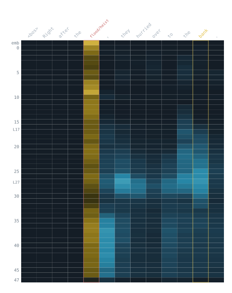
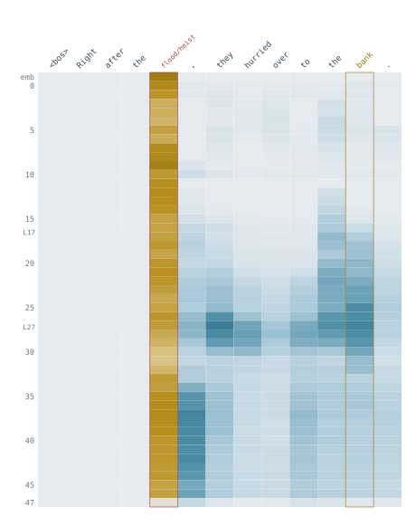

# Geometry page — what's needed to complete

Status of `geometry.html` (The Probing Notebook, bucket #2). Everything below is the
gap between "shippable now" and "final." The page **works and is deployable today**;
the data figures are the only real outstanding work, and that's a Claude-Code job.

---

## 1. Status at a glance

| Piece | State |
|---|---|
| Page architecture, copy, flow, type, both themes | ✅ done (built from the locked `.md`) |
| Cool design system + light/dark + theme-aware figures | ✅ done |
| **Crane heatmap** (Fig 3) | ✅ faithful — real geometry, reoriented (tokens top / depth down), both palettes |
| 5 line charts (Figs 1,2,4,5,6) | ⚠️ **palette-remapped stand-ins** of the old warm draft — correct *look*, approximate *data*. Regenerate from scan JSON. |
| 8-pair specimen gallery | ⚠️ **placeholder plates** — layout/UX done, heatmaps not generated |
| Favicon | ✅ inline (divergence-fork glyph) |
| Mobile responsive rules | ✅ baked; axis-flip for wide charts = a later pass (see §5) |

The authoritative color + figure spec lives in a big HTML comment at the **bottom of
`geometry.html`** (`COLOR-MAP SPEC` + `MOBILE FLOW NOTES`). This doc expands it.

---

## 2. Figures — the real work (regenerate from scan JSON)

Every figure ships in **two palettes**: `figX.svg` (dark) + `figX.light.svg` (light).
The page already references both and swaps them on the `.light` class. So the build
script must render **each figure twice** with the dark/light token sets in `DESIGN.md`.

**Governing rule (all figures): identical/quiet → the page ground; divergence/signal →
maximum contrast.** Bright-on-dark, dark-on-light. Never produce a figure with a baked
black background — the plate is supplied by the page (`var(--bg2)`); figures should let
quiet regions equal that ground so they blend.

| File | Source PNG / data | Regenerate to |
|---|---|---|
| `figConcept` (Fig 1, establishing scan) | `scans/data/gemma4_12b_mxfp4_centered_last.png` | centered-cosine per layer; highlight L18–27 plateau **and the L47 cliff** (it's reused by the closing section). |
| `figDelta` (Fig 2) | `..._delta.png` | per-layer ‖Δh‖; front/back quiet, middle hot. |
| `figCrane` (Fig 3) | `..._sleeper_heatmaps.png` | ✅ already faithful — keep as the reference for heatmap style. Only regenerate if you want the canonical data exactly. |
| `figStaircase` (Fig 4) | `..._staircase.png` | short vs long-range cosine at shared token; **mark global layers 5,11,17,23,29,35,41,47**; show onset is depth-gated. ⚠️ current stand-in collapses two series to citron — fix first. |
| `figCrossLang` (Fig 5) | `..._crosslang.png` | 4 type curves; **colorblind-critical** — keep markers + dash patterns, CB-safe set (see DESIGN §chart). ⚠️ regenerate (stand-in is approximate). |
| `figWiC` (Fig 6) | `..._wic_bands.png` | same- vs different-sense bands; peak gap at L20. |

Line charts are also the **mobile problem** (viewBox ~900 wide). When regenerating, emit
a **tall axis-flipped variant** too (layer on Y) — see §5.

---

## 3. The 8 specimen heatmaps (gallery)

Currently 8 placeholder plates + 1 counterexample, in a small-multiples grid. For each,
generate a per-token × per-layer cosine heatmap and drop it into the plate.

- **Same recipe as the crane**: token across the **top**, depth **down** (emb→L47),
  divergence ignites (cividis→cool ramp per DESIGN), shaded band **L17–27**, tracked
  token marked. Two palettes each.
- **Naming**: `figures/specimen_<tok>.svg` + `.light.svg` (`bank, shoot, howdoyou, novel,
  fall, late, mean, battery`).
- **Markup swap**: in each `.spec-plate`, replace the placeholder children with:
  ```html
  
  
  ```
  (the `.fig-dark/.fig-light` swap CSS is global, already in the page head).
- **Counterexample (Lead)**: keep the `.spec.fail` treatment (violet outline) — generate
  its heatmap with the same violet "this failed" border so it reads as broken-on-purpose.
- ⚠️ **Shoot sentences** are unrecovered — pull the camera/rifle pair from the
  `gemma4_12b_distance_heatmaps.png` source pairs before generating. All other sentence
  strings are in the `.md` / session JSONL.

Keep the all-visible small-multiples layout — the recurrence of the shape *is* the
finding; do not convert to a toggle/accordion.

---

## 4. Content / wiring TODO

- **Nav paths** (confirmed with you):
  - `Vivisection Lab → ../vivisection-lab/index.html` ✅ keep (relink on your side).
  - `Methods → methods.html` — becomes this bucket's own methodology page. Stub it or
    point at the shared lab methods page until it exists.
  - `index.html` (home / "THE PROBING NOTEBOOK") — **doesn't exist yet**. Until the hub is
    built, either point the home link at `geometry.html` or stub `index.html`. Your idea of
    a hub where each cosine-scan thumbnail links to a model page is the right shape; the
    geometry page can double as the "preview" specimen.
- **`methods.md` / Methods link** target doesn't exist — stub or repoint.
- The closing section references **Fig 1** by `href="#"` — give Fig 1 an `id` (e.g.
  `id="fig-scan"`) and point the L47 callback at it once the establishing scan is final.
- Decide the **slug/title** — "day-zero" framing is intentionally perishable; fine.

---

## 5. Mobile / responsiveness pass (non-blocking)

Baked already: col-side & marginalia collapse <820px (aside moves above its prose),
gallery 4→2→1, stats wrap, figures scroll-x. The remaining item:

- **Axis-flip for the wide line charts** (`figConcept, figDelta, figStaircase,
  figCrossLang, figWiC`). Regenerate a **tall variant with layer on the Y axis** and swap
  by media query (genuine re-layout — **never `rotate(90deg)`**, it skews labels/taps).
  Anchor **both** orientations with a fixed `L0→L47` label so depth direction never flips
  meaning between desktop and mobile.
- Heatmaps (crane + 8 specimens) are already vertical-depth → mobile-fine, no flip.
- Add a faint "scroll →" affordance on `.fig-plate` under 820px as an interim before the
  flip lands.

---

## 6. Ship checklist

- [ ] Regenerate Figs 1,2,4,5,6 from scan JSON, **both palettes**, per the color-map spec.
- [ ] Generate 8 specimen heatmaps + Lead counterexample, both palettes; wire into plates.
- [ ] Recover the **Shoot** sentence pair.
- [ ] Stub/point `index.html` + `methods.html`; give Fig 1 an `id` for the L47 callback.
- [ ] (Later) tall axis-flipped variants of the 5 line charts for mobile.
- [ ] Final read pass; confirm both themes; deploy as its own repo/site alongside the lab.
